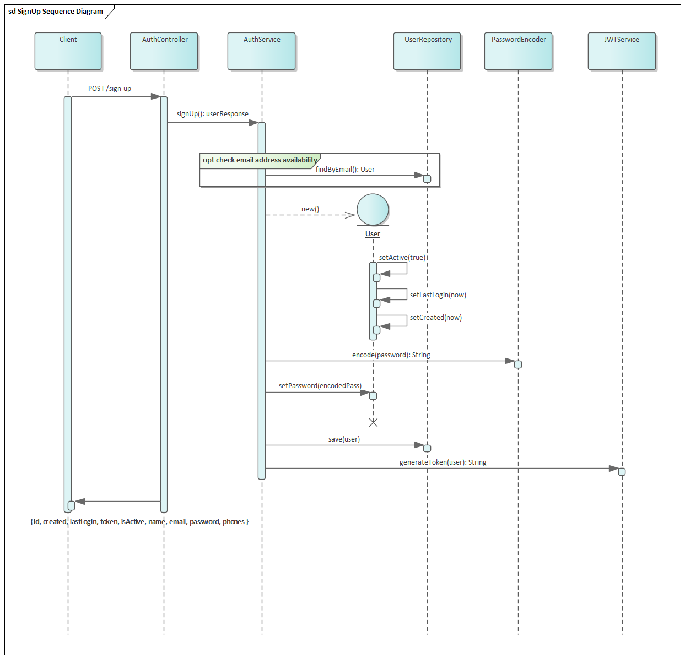
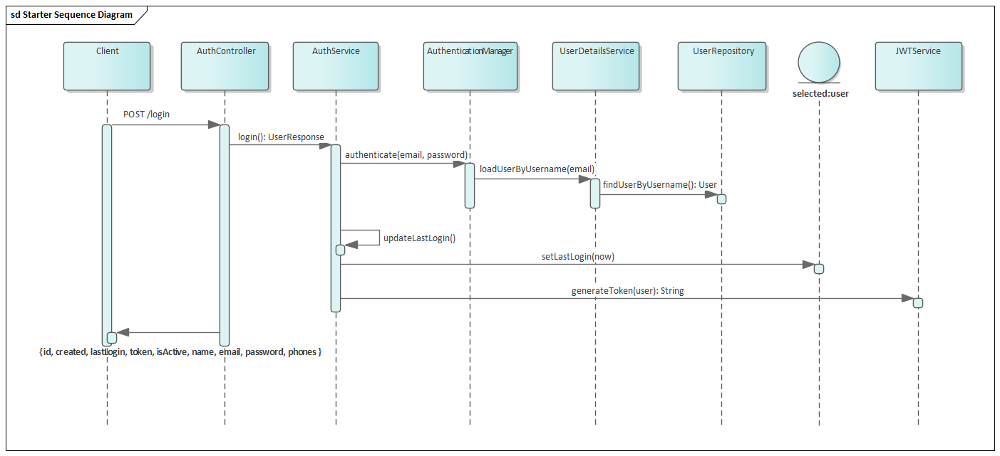
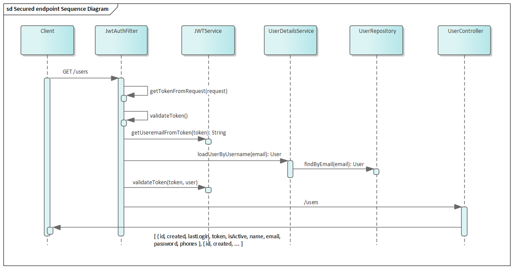

# Auth-API

Microservicio para la creación y consulta de usuarios

## 📌 Funcionalidades

- Registro de usuarios (`/sign-up`)
- Login con generación de JWT (`/login`)
- CRUD de usuarios (solo accesible con token válido)

### Funcionamiento del proceso de seguridad

**Sign-up**


**Login**


**Autenticación de otras consultas**


## 🚀 Stack

- Java 11+
- Spring Boot (Security, Web, Data JPA, Validation)
- H2 Database
- JJWT (Json Web Token)
- Lombok
- JUnit 5 & Mockito
- Gradle
- JaCoCo

## 📦 Instalación y Ejecución

### 🔧 Prerrequisitos

- Java 11 o superior
- Gradle (o usar el wrapper incluido: `./gradlew`)
- IDE como IntelliJ o VSCode (opcional)

### ▶️ Ejecutar localmente

```bash
./gradlew bootRun
```
